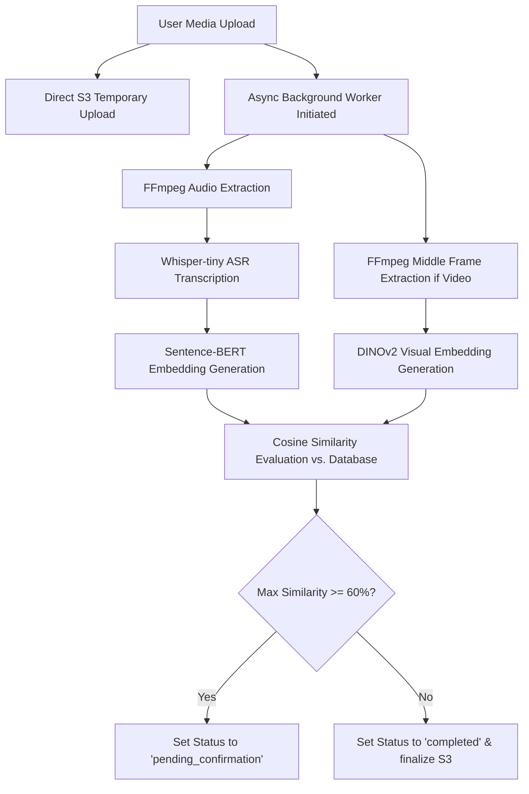

# ☁️ CloudDedup Pro: ML-Assisted Secure Hybrid Cloud Deduplication

CloudDedup Pro is an enterprise-grade, high-performance, secure cloud storage system that combines **Machine Learning (ML) prediction** with **Convergent Narrowing Storage (CNS)** to maximize storage efficiency and ensure data security. 

It implements end-to-end secure deduplication: standard files are encrypted locally (using AES-256 convergent encryption) before being synced to the cloud, while audio and video uploads undergo real-time transcription and semantic similarity evaluation.

---

## 🚀 Key Features

*   **Secure Authentication & RBAC**: Advanced login/registration system with Role-Based Access Control (Admins vs. Standard Users).
*   **AI Content Moderation**: Real-time TF-IDF content filtering and GPT-4 Vision & DINOv2 analysis reject inappropriate uploads (explicit, profanity, violence) before they are stored.
*   **Convergent Narrowing Storage (CNS)**: Client-side AES-256 convergent encryption where keys are derived from the file content itself, preventing identical ciphertexts from consuming multiple storage slots.
*   **ML-Assisted Deduplication Prediction**: Uses a Decision Tree model to predict duplicate likelihood based on file metadata before hashing, minimizing computing overhead.
*   **Advanced Duplicate Detection**:
    *   🔴 **Identical File Detection (100% Match)**: Pre-upload client-side SHA-256 hash checks instantly intercept duplicates. Shows details of the existing file and provides options to **Link Instantly** (to reuse storage reference) or **Don't Store** (to cancel upload).
    *   ⚠️ **Content Similarity Detection (60%+ Match)**: Uses TF-IDF cosine similarity for text/PDF and GPT-4 Vision / DINOv2 for images to detect near-duplicates.
    *   ⚠️ **Video Visual Similarity Detection (60%+ Match)**: Extracts the middle frame of videos using FFmpeg and computes visual embeddings via DINOv2 to prevent visual duplicates.
    *   ⚠️ **Metadata Similarity Detection**: Catches files with similar names or sizes but different contents.
*   **Asynchronous Audio & Video Processing**: Background workers extract audio tracks via FFmpeg (for Whisper ASR speech transcription) and extract middle frames via FFmpeg (for DINOv2 visual similarity), computing combined transcript and visual embeddings.
*   **Real-time AJAX Polling**: Seamless frontend status polling at `/audio/status/<id>` and `/video/status/<id>` with custom loading messages and similarity confirmation modals.
*   **Hybrid Cloud Storage**: Seamlessly switches between local disk storage and **AWS S3** for production scalability.
*   **Integrity Auditing (TPA)**: Simulates a Third-Party Auditor using block-based hash chains to verify that stored data has not been corrupted.
*   **Premium Interactive Dashboard**: Dark-mode user interface with real-time statistics on space savings, deduplication rates, audit logs, and file management tables.

---

## 🛠️ Technology Stack

| Component | Technology | Description |
| :--- | :--- | :--- |
| **Backend** | Python, Flask, Flask-Login, Flask-Bcrypt | Core routing, security, and session management |
| **Database** | MySQL (with SQLite-like MySQL-Wrapper compatibility) | Schema and metadata storage |
| **Machine Learning** | Scikit-Learn (Decision Tree, TF-IDF Vectorizer) | Pre-hashing likelihood prediction and text/PDF similarity |
| **Speech-to-Text** | Hugging Face / OpenAI Whisper-tiny | Local ASR speech transcription pipeline |
| **Semantic Embeddings** | Sentence-BERT (`all-MiniLM-L6-v2` / `all-mpnet-base-v2`) | Semantic comparison for transcripts |
| **Image Analysis** | OpenAI GPT-4 Vision & DINOv2 | Image moderation safety and deep semantic visual similarity |
| **Media Processing** | FFmpeg (via static-ffmpeg) | Fast audio track extraction and format conversion |
| **Video Frame Processing** | FFmpeg / ffprobe (via static-ffmpeg) | Middle-frame extraction for visual similarity analysis |
| **Encryption** | Cryptography (AES-256 CBC) | Content-dependent convergent encryption |
| **Cloud Storage** | AWS S3 (Boto3 SDK) | Secure file hosting and deletion sync |
| **Frontend UI** | Bootstrap 5, Bootstrap Icons, AJAX Polling | Elegant dark-theme templates and dynamic status polling |

---

## 📂 Project Directory Structure

Below is an overview of the key directories and scripts making up the CloudDedup Pro architecture:

```
main-project-main/
├── app.py                     # Main Flask web application, routing, and background thread logic
├── config.py                  # Environment-driven configuration variables and directory initializers
├── dedup.py                   # CNS convergent encryption, SHA-256 hash checks, and deduplication logic
├── content_moderator.py       # TF-IDF text/PDF scanner and OpenAI GPT-4 Vision image moderation
├── content_similarity.py       # Cosine similarity matching engine for documents and images
├── auditing.py                # Integrity auditing module utilizing block-based proof of storage (TPA)
├── whisper_service.py         # Whisper ASR initialization and speech-to-text transcription
├── sentencebert_service.py    # Sentence-BERT embedding creation for semantic comparisons
├── similarity_service.py      # Combines Whisper and SBERT to handle speech similarity matching
├── suspicious_upload_detector.py # Tracks and logs anomalous upload patterns (rapid uploads, PoW failures)
├── mysql_wrapper.py           # Compatibility abstraction layer to query MySQL using SQLite syntax
├── init_db.py                 # Seeds database tables and creates the default admin user
├── run.py                     # Wrapper starting script that checks models, database, and runs Flask
├── test_aws_credentials.py    # Detailed validation script for testing S3 bucket access & IAM roles
├── test_both_creds.py         # Validation utility to verify multiple S3 credentials
├── templates/                 # Bootstrap 5 HTML views (dashboard, upload, login, audit, admin panels)
├── static/                    # Custom CSS stylesheets, loaders, and client-side JavaScript
├── uploads/                   # Local storage backup folders (temp_files/ and stored_files/)
└── ml_data/                   # CSV dataset and serialized Decision Tree duplicate-prediction model (.pkl)
```

---

## ☁️ AWS S3 Cloud Storage Integration

CloudDedup Pro features deep integration with **AWS S3** as its cloud storage backend. When configured and enabled:
1. Standard encrypted files are uploaded directly to S3.
2. Background audio/video processing files are synced to S3 within seconds of upload.
3. Decrypting, downloading, and streaming files are fetched on demand from S3.
4. Purging or deleting files from the dashboard automatically issues API deletes to clean up the S3 objects.

### 1. Environment Configurations

To enable AWS S3, modify your `.env` configuration file in the root directory:

```env
# Toggle S3 integration (True = S3, False = Local storage fallback)
USE_S3=True

# AWS Credentials (provide your IAM credentials)
AWS_ACCESS_KEY=your_aws_access_key_id
AWS_SECRET_KEY=your_aws_secret_access_key
AWS_REGION=ap-southeast-2

# S3 Bucket Name
S3_BUCKET_NAME=deduplicationfile
```

> [!NOTE]
> **Graceful Fallback Mechanism**: If `USE_S3=True` but the `AWS_ACCESS_KEY` or `AWS_SECRET_KEY` variables are left blank in the `.env` file, the application prints a warning message and automatically disables S3 (sets `USE_S3` to `False`). The system will gracefully fall back to local disk storage (`uploads/stored_files/`), ensuring the application doesn't crash on startup.

---

### 2. Testing S3 Credentials & Permissions

Two utilities are included in the root directory to verify S3 configurations before starting the server.

#### A. Comprehensive AWS Test (`test_aws_credentials.py`)
This script checks the complete AWS configuration and logs detailed diagnostics. Run it with:
```powershell
python test_aws_credentials.py
```

It performs the following validation checks:
1. **Environment Variables**: Confirms that keys, region, bucket, and S3 status are loaded correctly.
2. **Library Installation**: Verifies that the `boto3` package is correctly installed.
3. **Client Connection**: Attempts to initialize the S3 client using the specified credentials.
4. **Credentials Validation**: Executes a `list_buckets()` command to verify if AWS IAM credentials are valid.
5. **Bucket Access**: Runs `head_bucket()` and `list_objects_v2()` on the configured bucket to verify read/write/list permissions.
6. **Region Alignment**: Checks if the configured region in `.env` matches the physical bucket region constraint to prevent routing latencies.

#### B. Multiple Bucket Validation Test (`test_both_creds.py`)
Useful if you are validating access permissions across multiple buckets or credentials defined in a list format:
```powershell
python test_both_creds.py
```

---

### 3. File Operations & S3 Interaction

*   **Upload Flow**: Standard uploads compute the file hash, check for exact duplicates, encrypt the file payload using AES-256 convergent encryption, and upload the ciphertext directly to S3 under the prefix `ciphertext/`.
*   **Interactive Polling Flow**: Audio and video uploads upload the media payload to S3 instantly under a temporary location. If similarity checks are confirmed or bypassed, the file remains in S3; if the upload is rejected or canceled, it is immediately deleted from S3.
*   **Auditing Flow**: When a Third-Party Audit (TPA) is requested, the auditor retrieves the ciphertext directly from S3, checks the block integrity, and verifies data alignment.
*   **Inline Streaming**: Privileged users can open media links that request pre-signed streaming or direct inline decrypt-streams from S3 so files can be played dynamically in the web browser.

---

## 🎙️ Audio & Video Processing Pipelines



### 1. Offline & Speed Optimizations
*   **Local-First Models**: Whisper and Sentence-BERT models attempt to load from local cache (`local_files_only=True` and `HF_HUB_OFFLINE=1`). This eliminates network checks that add a 10–30s latency overhead on application boot.
*   **Fast Extraction**: Extracted video audio tracks are saved as 16kHz mono WAV files (`pcm_s16le`), avoiding CPU-intensive MP3 compression steps.
*   **Short Snippets**: Evaluation is done on the first 30 seconds of files (customizable via `AUDIO_SNIPPET_DURATION`) for rapid comparisons.

### 2. User Confirmation Modals
If the similarity evaluation detects a matching media file in the database with $\ge 60\%$ similarity:
*   The processing status is updated to `pending_confirmation`.
*   The loader is cleared, and an interactive Bootstrap Modal appears.
*   The modal displays details of the similar file, the max similarity percentage (transcript or visual), and the transcript preview.
*   The user can choose:
    *   **Store anyway**: Keeps the file in S3/local and completes the DB registration.
    *   **Don't Store**: Immediately purges the file from S3/local and cleans up all temporary files.

---

## 🛡️ AI Content Moderation

To protect storage from policy violations, files are analyzed **before** they are stored:
*   **Text/PDF Analysis**: Uses a TF-IDF moderation engine to scan text files (`.txt`, `.pdf`, `.py`, `.json`, etc.) against explicit, profanity, and violence term-vectors.
*   **Image Analysis**: Uses **OpenAI GPT-4 Vision** (for safety flagging) and **Facebook DINOv2** (semantic similarity checks to prevent duplicate media uploads).
*   **Rejection Flow**: If similarity with harmful vectors exceeds `35%` (configurable in `content_moderator.py`), the upload is rejected. The local temporary file is deleted, the upload is cancelled, and logs are inserted into `moderation_logs` and `suspicious_activities` tables for admin review.

---

## 🐳 Docker Deployment (Recommended)

To deploy the entire stack—including the MySQL database—with a single command:

1.  **Configure Environment Variables**:
    Create a `.env` file in the root directory (using `.env.example` as a guide) and populate it with your AWS and OpenAI keys.
2.  **Launch Containers**:
    ```bash
    docker-compose up --build
    ```
3.  **Access Dashboard**: Open `http://localhost:5000` in your web browser.

The setup scripts in the container automatically create the `cloud_dedup` database, seed tables, compile/train the Decision Tree model, and start the Gunicorn server.

---

## ⚙️ Manual/VS Code Setup

1.  **Prerequisites**:
    *   Install Python 3.11+
    *   Install MySQL Server
2.  **Virtual Environment**:
    ```bash
    python -m venv venv
    # Windows
    .\venv\Scripts\activate
    # macOS/Linux
    source venv/bin/activate
    ```
3.  **Install Dependencies**:
    ```bash
    pip install -r requirements.txt
    ```
4.  **Initialize MySQL Database**:
    *   Start MySQL server and run `CREATE DATABASE cloud_dedup;`
    *   Update `config.py` database credentials (e.g. Host, User, Password) if different from the default (`root` / `Bhanu@2004`).
    *   Run database initializer to configure schemas:
        ```bash
        python init_db.py
        ```
5.  **Run Application**:
    ```bash
    python run.py
    ```
6.  **Access application**: `http://127.0.0.1:5000`

### 🔑 Default Credentials
*   **Username**: `admin`
*   **Password**: `admin123`

### 💻 Running and Debugging in VS Code

A VS Code launch configuration `.vscode/launch.json` is included:
1. Select the Run and Debug side menu in VS Code (`Ctrl+Shift+D`).
2. Select **Python: Flask (run.py)** from the configuration dropdown.
3. Press `F5` to start the application with full debugging capabilities.

---

## 🛡️ Security Note & Production Guidelines

1.  **Convergent Keys**: Convergent encryption relies on a master `AES_KEY` in combination with content hashing. Keep your `AES_KEY` secure and unique.
2.  **AWS Security**: Ensure your IAM user has the minimum required permissions to read, write, and delete objects on the target S3 bucket (use Least Privilege principal).
3.  **Production Secret**: Always override `SECRET_KEY` in your production environments to prevent session hijacking.
